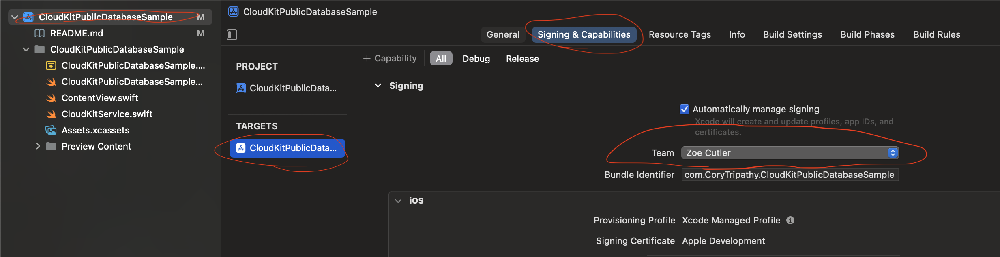
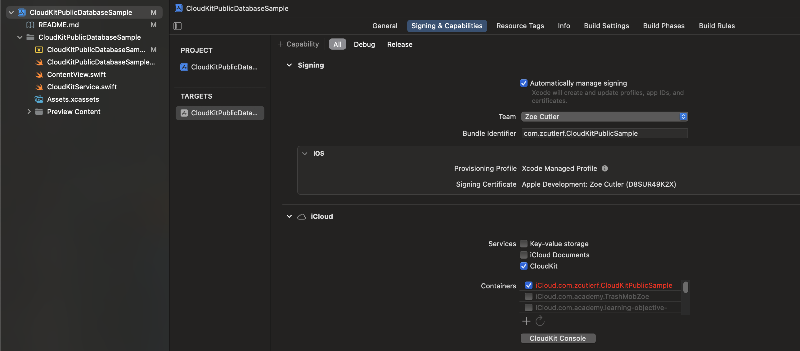
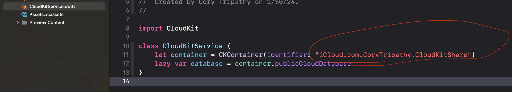

#  Sample Code: CloudKit Public Database

This is a sample app that allows users to add Events to CloudKit's public database, and see Events that other users have added.

## Setting Up

### Create your iCloud Container on CloudKit
1. In the Xcode Project File (blue icon on the top left of Xcode) -> for this iOS target -> signing and capabilities: change the development team to your development team (i.e.: select your name from the list).

2. Change the bundle identifier of the app to be unique to you, and the iCloud container to match. For example:
    * Bundle: `com.yourname.appname`
    * iCloud container: `iCloud.com.yourname.appname`

3. Press the refresh button below the iCloud containers so that Xcode updates it.
4. Open [CloudKit Console](https://icloud.developer.apple.com/) and log in with your developer account info. Click on "iCloud database."

5. Using the dropdown on the top left, make sure that you can find the container you just created (i.e.: `iCloud.com.yourname.appname`) in the list of containers.

4. Go to the `CloudKitService` class and change its `container` property. Paste your iCloud container name (from signing and capabilities OR iCloud console) into the `CKContainer(identifier:)` initializer.
